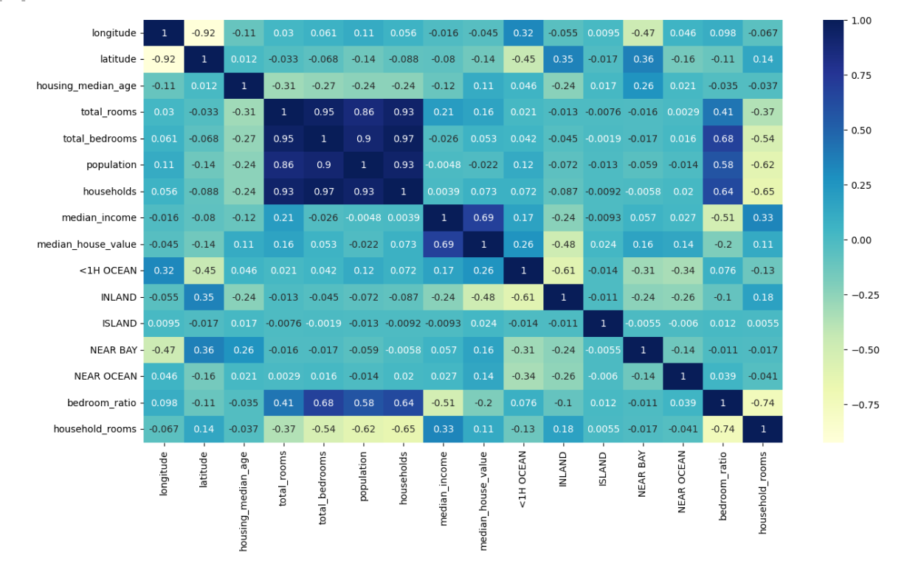
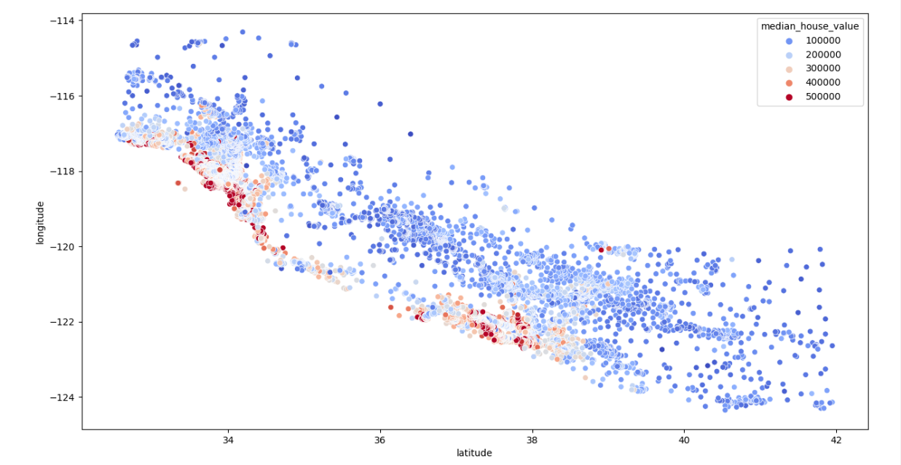

# California House Price Prediction

## Demo Link
[California House Price Prediction Demo](https://www.kaggle.com/code/suryanarayanank/california-house-price)

## Business Understanding
This project aims to understand how house prices are determined and how they correlate with various factors in California. By analyzing the data, we can gain insights into the housing market trends and factors influencing house prices.

## Data Understanding
The dataset includes the following features:
1. Longitude: Indicates how far west a house is.
2. Latitude: Indicates how far north a house is.
3. Housing Median Age: Median age of houses within a block; lower values represent newer buildings.
4. Total Rooms: Total number of rooms within a block.
5. Total Bedrooms: Total number of bedrooms within a block.
6. Population: Total number of people residing within a block.
7. Households: Total number of households within a block.
8. Median Income: Median income for households within a block (measured in tens of thousands of US Dollars).
9. Median House Value: Median house value for households within a block (measured in US Dollars).
10. Ocean Proximity: Indicates the location of the house with respect to the ocean/sea.

## Screenshots

## Analysis
I have cleaned the data by:
- Dropping null rows
- Providing one-hot vectors for categorical variables
- Found correlation between variables using heatmap, etc.

## Technologies
- NumPy
- Pandas
- Matplotlib
- Seaborn
- Scikit-learn
  - Linear Regression
  - Random Forest Regressor

## Setup
You can try out this model using the California housing prices dataset available on Kaggle: [California Housing Prices Dataset](https://www.kaggle.com/datasets/camnugent/california-housing-prices)

## Accuracy
- Linear Regression: 0.6687407117584969
- Linear Regression (After Scaling): 0.6692303774756764
- RandomForestRegressor: 0.7649087057809763
- GridSearchCV RandomForestRegressor: 0.771010764128469

## Status
The project has been completed successfully, providing valuable insights into data analysis concepts and data science methodologies.
